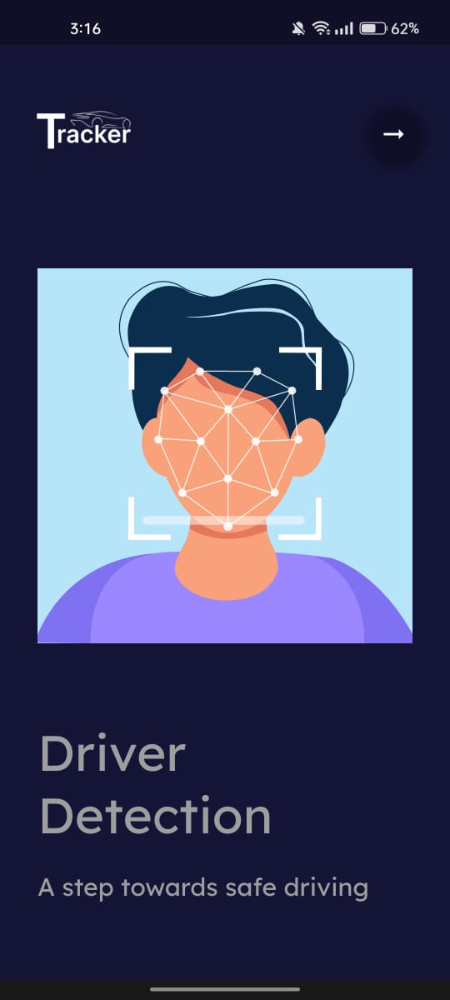
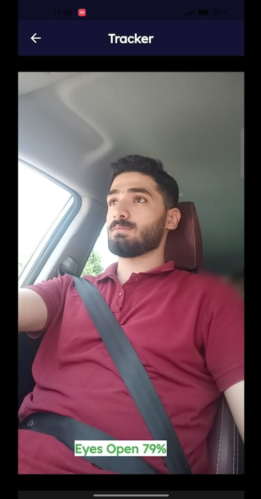
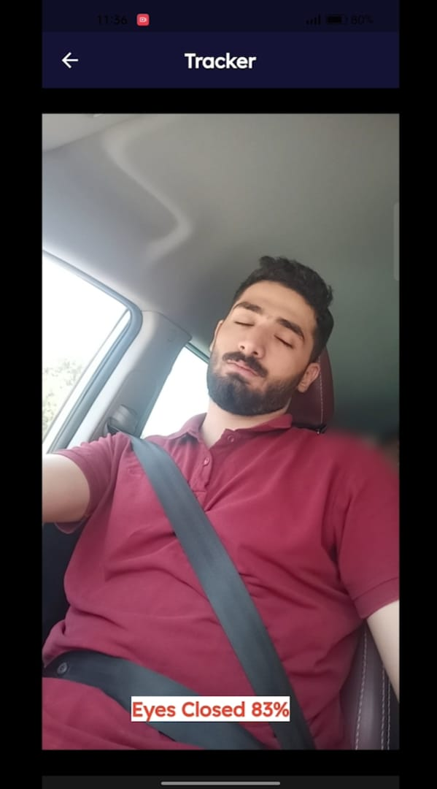

# Driver Drowsiness Detection

A mobile application aimed at improving road safety by detecting driver drowsiness. Built using Flutter and Dart, this application integrates a machine learning model trained with a Convolutional Neural Network (CNN) using TensorFlow Lite for real-time performance on mobile devices.

## Table of Contents

- [Introduction](#introduction)
- [Features](#features)
- [Screenshots](#screenshots)
- [Installation](#installation)
- [Usage](#usage)
- [Model Training](#model-training)
- [Technologies Used](#technologies-used)
- [Contributing](#contributing)
- [License](#license)

## Introduction

Driver Drowsiness Detection is an innovative solution to help prevent accidents caused by driver fatigue. By analyzing real-time video feeds from the driver's device, the application can determine whether the driver is drowsy or alert and notify them accordingly.

## Features

- Real-time driver drowsiness detection
- High accuracy model trained using CNN
- Seamless integration with TensorFlow Lite for mobile optimization
- User-friendly interface with clear notifications
- Supports multiple devices

## Screenshots

### Welcome Screen



### Driver Detection Screens




## Installation

1. Clone the repository:
   ```bash
   git clone https://github.com/yourusername/driver-drowsiness-detection.git
## usage
1.Connect your mobile device or start an emulator.

2.Run the application:
  ```bash
flutter run


